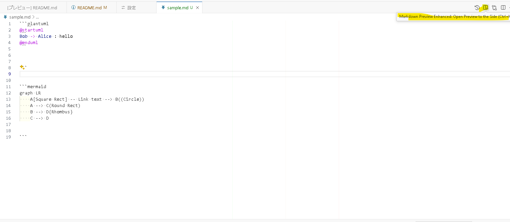
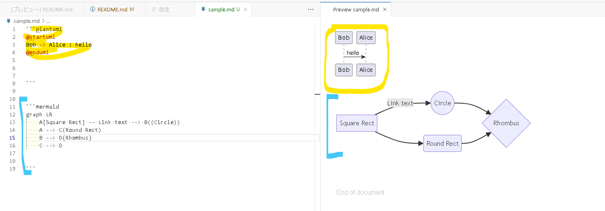
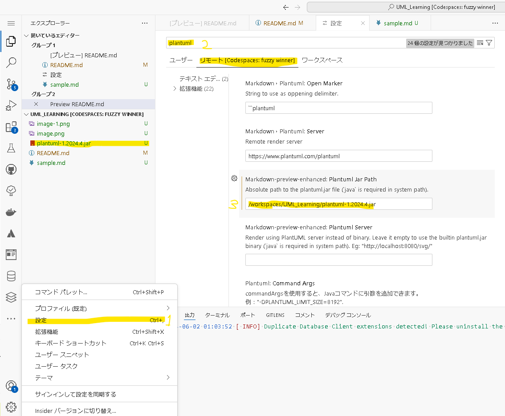

# UML_Learning
UMLの学習記録です。

目標は

１．UMLについて体系的な知識を身につける

２．業務で使えそうなUML図を検討つけること

コミュケーションのズレを減らせる搦め手になれば良いという意識

※UMLの資格の取得は決めてない。

# 開発環境
|名称|説明|
|---|----|
github Codespaces |ブラウザで動くIDE
PlantUML|拡張機能　mdファイル上でPlantUMLを表示する機能 作者 jebbs
MarkDown Preview Mermaid Support| mdファイル上でMermaidを表示する機能　作者 Matt Bierner

# 使い方
Markdown Preview Enhanced:Open Preview to the Sideを押す。

ショートカットキーは「Ctrl + K」

表示される

# PlantUML初期設定

１．「Ctrl + , 」で設定画面を開く

２．検索欄に「PlantUML」と検索する

３．リモートタブのMarkdown-preview-enhanced: Plantuml Jar Pathの入力欄に以下の値を入力

「/workspaces/UML_Learning/plantuml-1.2024.4.jar」

４．mdファイルのplantUMLがプレビューされることを確認

# 参考資料

## 本
かんたんUML入門 改訂２版 株式会社オージス総研　（紙の書籍）

[改訂版]UMLモデリング技能認定試験 UML2.0対応 入門レベル(L1)問題集 株式会社オージス総研　（紙の書籍）

## web

### mermaid.js document

https://mermaid.js.org/intro/

### PlantUML

https://plantuml.com/ja/