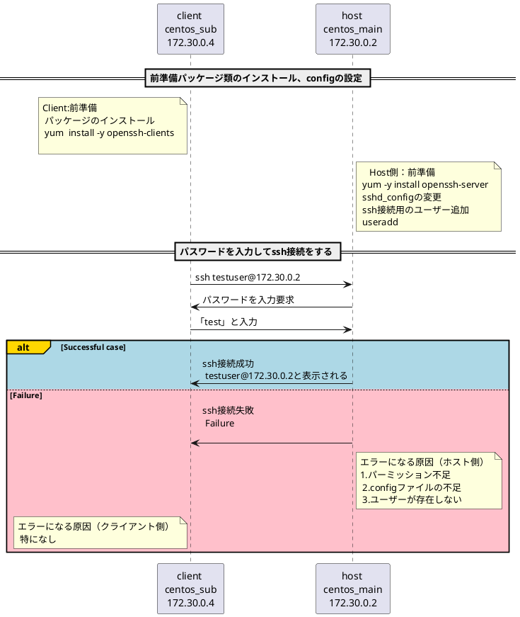
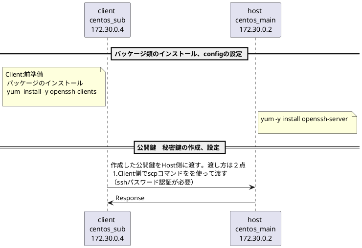

 
SSH認証
## パスワード認証
ユーザー名とパスワードでssh接続する方法
シーケンス図で図式化します。

```plantuml
@startuml

==前準備パッケージ類のインストール、configの設定 ==
Participant "client \n centos_sub \n172.30.0.4" as Client
Participant "host \n centos_main \n172.30.0.2" as Host
note left of Client : Client:前準備\n パッケージのインストール\n yum  install -y openssh-clients \n
note right of Host :　Host側：前準備\n yum -y install openssh-server \n sshd_configの変更 \n ssh接続用のユーザー追加　\n useradd
== パスワードを入力してssh接続をする ==

Client -> Host : ssh testuser@172.30.0.2

Host -> Client : パスワードを入力要求
Client-> Host: 「test」と入力
alt#Gold #LightBlue Successful case
Host -> Client: ssh接続成功\n testuser@172.30.0.2と表示される
else #Pink Failure
Host -> Client: ssh接続失敗\n Failure \n
note right of Host: エラーになる原因（ホスト側） \n1.パーミッション不足 \n 2.configファイルの不足 \n 3.ユーザーが存在しない
note left of Client: エラーになる原因（クライアント側） \n 特になし
end
@enduml
```

qiita
https://qiita.com/sango/items/816136188387221f05b3

## 鍵認証

```plantuml
@startuml

== パッケージ類のインストール、configの設定 ==
Participant "client \n centos_sub \n172.30.0.4" as Client
Participant "host \n centos_main \n172.30.0.2" as Host
note left of Client : Client:前準備\n パッケージのインストール\n yum  install -y openssh-clients \n
note right of Host : yum -y install openssh-server \n
== 公開鍵　秘密鍵の作成、設定 ==

Client -> Host : 作成した公開鍵をHost側に渡す。渡し方は２点 \n 1.Client側でscpコマンドをを使って渡す \n（sshパスワード認証が必要）

Host -> Client : Response

@enduml
```

本気で学ぶ　linux p481-484