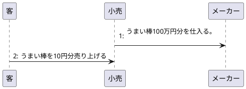

簿記の例

## 仕入　売上の例

```plantuml
@startuml
autonumber "0:"

Participant "客" as Client
Participant "小売" as Retail
Participant "メーカー" as Maker

Retail -> Maker: うまい棒100万円分を仕入る。 \n

Client -> Retail : うまい棒を10円分売り上げる

@enduml
```

番号|借方記号|借型金額|借方記号|借型金額|
---|----|----|----|---
1|仕入|100|現金|100|
2|現金|100|売上|100|
3|||||
4|||||
5|||||
6|||||
7|||||
8|||||
9|||||